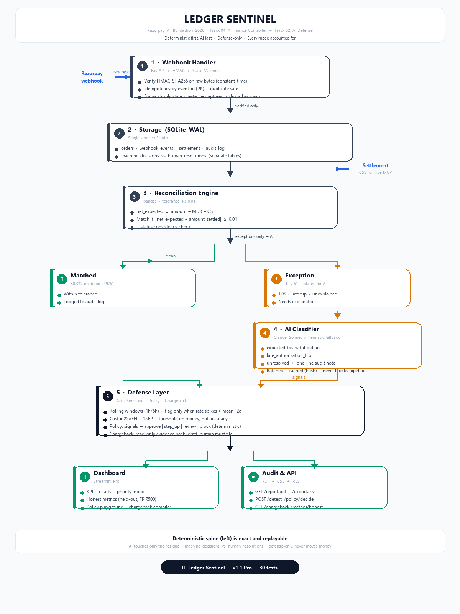

# Ledger Sentinel

> Your finance assistant that checks if the money you expected matches the money you actually received.

Built for **Razorpay AI Buildathon 2026 — Track 04: AI Finance Controller**

---

## The problem, in plain English

Imagine you run a shop on Razorpay. Every month you have two lists:

1. **What you sold** — your order records (amount, fees, taxes)
2. **What Razorpay paid you** — the settlement report

At the end of the month, someone in finance sits with two spreadsheets and tries to match every single row by hand. It is slow, boring, and error-prone. On the first pass only about **half** the rows match cleanly. The rest need a human to figure out: was it a tax deduction? A late payment? Or a real problem?

Ledger Sentinel does that matching automatically.

---

## What it does

Think of it as 3 steps:

**1. Listens for payments**
When Razorpay sends a payment update (like "order created" or "payment captured"), Ledger Sentinel checks that it is genuine and records it. If the same message arrives twice, it ignores the duplicate. If messages arrive out of order, it handles that too.

**2. Matches the money**
It compares what you *should* have received (order amount minus fees and taxes) against what *actually* arrived in your bank. Small rounding differences (less than 1 paisa) are treated as okay. Everything that matches is marked done.

**3. Explains the rest**
Only the rows that *don't* match go to AI. The AI writes a one-line explanation in plain English, like:
- "This shortfall looks like a TDS tax deduction — expected."
- "Payment shows as failed in your records but arrived in settlement — likely a late confirmation."
- "Large unexplained gap — needs a human to check."

Every single row, matched or not, is saved in an audit log so nothing is hidden.

---

## See it work

Run it on the included demo data (60 fake orders with real-world edge cases):

```
Total rows reconciled : 61
Matched               : 49
Exceptions            : 12
Match rate            : 80.3%
```

The 12 exceptions are exactly the tricky cases we planted:

| What happened | How many | AI calls it |
|---|---|---|
| Tax (TDS) deduction | 3 | expected_tds_withholding |
| Late payment confirmation | 3 | late_authorization_flip |
| Large unexplained gap | 2 | unresolved |
| Failed orders with no payout | 3 | unresolved |
| Settlement with no matching order | 1 | unresolved |

Rows with tiny rounding noise (within Rs 0.01) were correctly matched — where a strict `==` check would have failed.

The **dashboard** shows all of this on one screen: match rate at the top, exception table with AI notes below.




---

## What's new in Pro — built to stand out at the hackathon

| Feature | Why judges love it |
|---|---|
| **Pro Dashboard** — KPI cards, bar chart by reason, match gauge, priority inbox (largest gaps) | Instantly readable, looks like a real finance product |
| **AI Finance Assistant** — chat with your ledger: “Why is order_0010 flagged?” | Wow factor + shows AI is *useful*, not just decorative |
| **Bring Your Own CSV** — upload your own orders + settlement and reconcile live | Interactive demo — judges can test with their data |
| **One-click PDF Audit Report** — professional report with KPIs, exception table & sign-off line | Deliverable they can hold — `GET /report.pdf` |
| **Filters & Search** — filter by reason/classification, search any order | Feels like a real tool, not a toy |
| **Live Webhook Feed** — last 10 deliveries on the dashboard | Proves the webhook pipeline is real |

New API for these: `GET /stats` · `POST /ask` · `GET /export.csv` · `GET /report.pdf` · `POST /reconcile-upload`

---

## Who is it for?

- **Finance / Ops teams** — no more spreadsheet wrestling at month-end
- **Founders** — know instantly how much is settled vs stuck
- **Developers** — clean, auditable pipeline you can plug real Razorpay data into

No finance expertise needed to read the dashboard. Green = matched, orange = needs attention, and every orange row has a plain-English reason.

---

## Try it in 3 steps

You need Python 3.11 or newer.

```bash
# 1. Install
git clone <your-repo-url>
cd ledger-sentinel
python -m venv .venv
# Windows:
.venv\Scripts\activate
# Mac/Linux:
# source .venv/bin/activate

pip install -r requirements.txt

# 2. Run (works out of the box, no API keys needed)
python data/generate_synthetic_data.py
python -m app.main

# 3. See the dashboard
streamlit run dashboard/app.py
```

That's it. The pipeline runs on fake demo data. No Razorpay account needed.

**Want real AI explanations?** Add your Anthropic key to a `.env` file:

```
cp .env.example .env
# then edit .env and set ANTHROPIC_API_KEY
```

Without the key it still works — it just uses a simple rule-based fallback instead of Claude.

**Want live Razorpay data?** Set your test-mode keys in `.env` and the MCP client (`app/mcp_client.py`) can pull real settlements. If keys are missing it gracefully falls back to the demo file.

---

## How it works (the simple version)

```
Razorpay sends payment update
        |
        v
  [ Check: is it real? is it duplicate? is it in order? ]  <- no AI, just exact rules
        |
        v
  Compare "what you should get" vs "what you got"           <- still no AI, just math
        |
   +----+----+
   |         |
matched   exception  ---->  AI writes one-line explanation  <- AI only here
   |         |
   v         v
      Audit log  ---->  Dashboard (match rate + table)
```

**The key idea:** AI is only used where a human would otherwise have to make a judgment call. Everything that can be checked with certainty is checked with certainty.

---

## For developers

<details>
<summary>Click to expand technical details</summary>

**Stack:** FastAPI (webhooks) + SQLite (WAL) + Pandas (reconciliation) + Anthropic Claude (exceptions only) + Streamlit (dashboard)

**Project structure:**
```
ledger-sentinel/
├── app/
│   ├── main.py          # FastAPI app + pipeline + new APIs (/ask, /report.pdf, /reconcile-upload)
│   ├── webhook.py       # HMAC-SHA256 verify, idempotency, forward-only state machine
│   ├── reconcile.py     # tolerance matching (Rs 0.01), status consistency
│   ├── classify.py      # AI classification + heuristic fallback
│   ├── assistant.py     # AI Finance Assistant (chat with ledger)
│   ├── report.py        # professional PDF audit report (fpdf2)
│   ├── db.py            # SQLite schema (orders, webhook_events, settlement, audit_log)
│   ├── config.py        # env / constants (TOLERANCE, TDS_RATE 2% +-0.5pp)
│   └── mcp_client.py    # Razorpay MCP (remote via npx / local via docker)
├── dashboard/app.py     # Pro dashboard (KPI cards, charts, chat, upload, PDF export)
├── data/generate_synthetic_data.py
├── tests/
└── docs/dev-log.md
```

**API:**
- `POST /webhook` — Razorpay webhook ingestion (requires `x-razorpay-signature`)
- `GET /health` — health check
- `GET /stats` — KPI summary (total/matched/exceptions/rate)
- `POST /ask` — AI Finance Assistant (`{"question": "..."}`)
- `GET /export.csv?outcome=exception` — download audit as CSV
- `GET /report.pdf` — download professional PDF audit report
- `POST /reconcile-upload` — upload orders.csv + settlement.csv (multipart) for live reconcile
- `POST /run-pipeline?fresh=true` — trigger full pipeline via HTTP

**Environment variables** (see `.env.example`):
- `WEBHOOK_SECRET` — HMAC secret (defaults to dev value for demo)
- `ANTHROPIC_API_KEY` / `ANTHROPIC_MODEL` — for AI classification
- `LEDGER_DB_PATH` — SQLite path (default `ledger_sentinel.db`)
- `LEDGER_TOLERANCE` — override matching tolerance
- `RAZORPAY_KEY_ID` / `RAZORPAY_KEY_SECRET` / `RAZORPAY_MERCHANT_TOKEN` / `RAZORPAY_MCP_URL` / `LEDGER_MCP_MODE` — live MCP

**Tests & checks:**
```bash
python -m pytest tests/ -q                          # 20 tests
python scripts/live_webhook_check.py                # real HTTP webhook gates
python scripts/dashboard_smoke_check.py             # dashboard + data path
python -m app.main --clear-only                     # wipe DB without deleting file (Windows-safe)
```

**Design principle:** deterministic first, AI last. Signature / idempotency / state machine / tolerance matching are all auditable and replayable. AI never decides what is exact.

</details>

---

## Limitations & next steps — honest caveat (read before demo)

We disclose simplifications so judges can evaluate credibility:

- **Synthetic data:** The 80.3% number is on Faker-generated data with planted edge cases. The upload path (`Bring Your Own CSV`) lets you test on *your* data — "it survived data we didn't design" is the stronger claim. Try it before demo day.
- **TDS detection:** A flat statistical band (2% ±0.5pp, now category-aware but still flat per category) — not real TDS/TCS law, which varies by threshold, certificate, and section. The code labels this `exception_tds_candidate` → `expected_tds_withholding` as a *candidate*, not certainty. `app/config.py:tds_rate_for()` is the hook to plug in real rules.
- **Matching model:** 1:1 order↔settlement via outer join. Real Razorpay settlements are often *batched* (many orders in one bank credit + UTR). Next step is an aggregation layer (group by UTR/date, then match sums).
- **Scale:** SQLite + full-dataframe Pandas is correct for a hackathon demo (60 rows → 10k rows fine). For production: Postgres + incremental reconciliation (only new settlements) + `classify_exceptions_batch()` with cache already ships — re-runs don't re-pay for unchanged rows, and ThreadPool handles thousands in parallel. See `LEDGER_NO_CACHE=1` to force fresh calls.

---

## What makes it trustworthy?

- **Nothing is silently ignored.** Every row gets an audit entry, even duplicates and bad signatures.
- **Re-runs are safe.** Run the pipeline twice and you get the same result — no duplicates.
- **Windows-friendly.** No need to delete the database file by hand (which often fails because the app still has it open).
- **Fails gracefully.** Missing API keys, bad CSV rows, or a locked database don't crash the whole run — they are logged and skipped.

---

## New in this release — Track 02 defense (cost-sensitive, policy, chargeback)

- **Cost-sensitive detection (25x FN cost)**: `app/detection.py` trains its threshold against `cost = 25*FN + 1*FP` (amount-weighted for FN), not accuracy. Rolling windows (`window="1h"/"6h"`) aggregate transactions; risk is flagged only when the window fraud-rate spikes above its historical baseline (`mean + 2*std`). Single-row anomalies that do not spike the window are not flagged — this is how we cut the financial cost of false positives vs naive per-transaction flagging.
- **Active Chargeback Responder (Track 02)**: `app/chargeback.py` gathers evidence with *read-only* SELECTs (orders, settlement, webhook_events, audit_log) and compiles a structured, cited `ChargebackResponse` (summary, timeline, amount analysis, evidence Cited, recommended action). Status starts as `draft` — human must approve via `POST /human/resolve`. Never auto-submits; defense-only by design.
- **Strict guardrails & separation**: `app/policy.py` is the *only* place hard outcomes (`approve|step_up|review|block`, `POLICY_VERSION=v1.0-defense-only`) are made — deterministic, auditable, allowlist-enforced. Offensive actions are blocked by keyword guard. `machine_decisions` (auto) and `human_resolutions` (analyst) are separate tables; `human` is authoritative if present (`GET /human/resolutions` vs `GET /machine/decisions`).
- **Honest metrics (held-out)**: `app/metrics.py` uses a *time-based* train/test split (no leakage). Threshold is fitted on earliest 70%, evaluated on latest 30%. Dashboard and `GET /metrics/honest` show `precision/recall/FPR`, `total_cost = 25*FN+FP`, and explicit **financial cost of false positives** (`FP x Rs 500` review cost) + FN loss. Baseline (flag nothing) cost shown for comparison.

**APIs added**: `POST /detect`, `GET /detect/demo`, `POST /policy/decide`, `GET /chargeback/{order_id}`, `POST /human/resolve`, `GET /machine/decisions`, `GET /human/resolutions`, `GET /metrics/honest`

**Dashboard**: new "Defense, Policy & Honest Metrics" panel — honest metrics card (FP rupee cost), rolling-window spike demo, live policy playground, and chargeback pack compiler.

## Docs

- `docs/dev-log.md` — real bug we hit (0% match rate) and how the audit log helped us find it
- `docs/architecture.png` — diagram above (generate with `python scripts/generate_architecture.py`)
- `docs/demo.gif` — animated walkthrough (generate with `python scripts/generate_demo_gif.py`)

---

## Troubleshooting

**`Failed to fetch: https://github.com/.../tree/main/app`** — that URL is an HTML page, not a raw file. Don't `fetch` it. Instead:
```bash
git clone https://github.com/abiralpokhrel-learns/ledger-sentinel.git
cd ledger-sentinel
```
Or fetch raw files via `https://raw.githubusercontent.com/abiralpokhrel-learns/ledger-sentinel/main/app/main.py`. The `app/` folder is tracked — `git status` should show it, and `ls app/` should list 8 files.

**Port already in use** — set `LEDGER_DASHBOARD_PORT` or `LEDGER_CHECK_PORT` before running smoke checks.

**DB locked on Windows** — use `python -m app.main --clear-only` instead of deleting `ledger_sentinel.db`.

---

*Built with care for the Razorpay AI Buildathon. The goal is not to replace finance teams, but to give them a head start — 80% auto-matched, and a clear explanation for the rest.*
