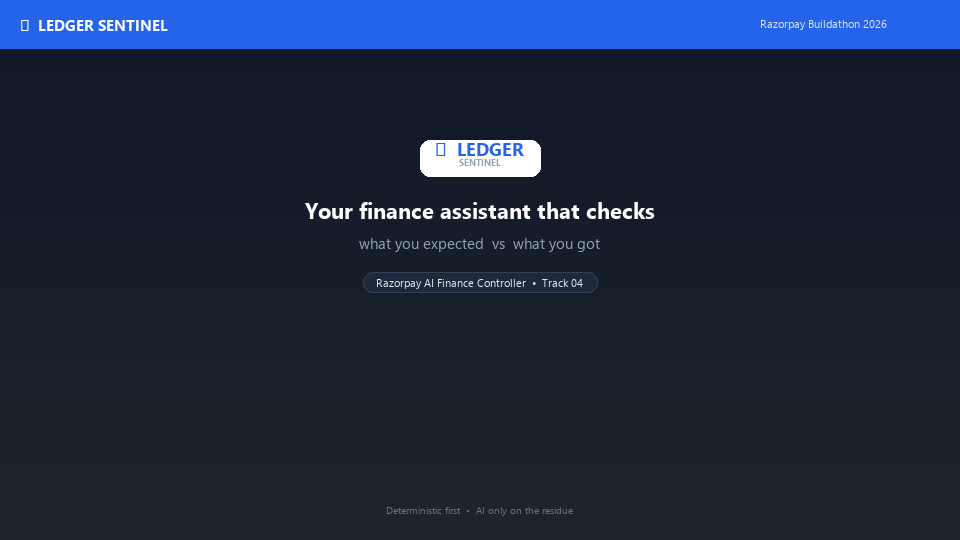

# Ledger Sentinel

> **Deterministic first, AI last. Defense-only. Every rupee accounted for.**

**Razorpay AI Buildathon 2026 — Track 04: AI Finance Controller + Track 02: AI Defense**

[](https://github.com/abiralpokhrel-learns/ledger-sentinel/actions) [](https://www.python.org) [](LICENSE) [](#testing)

> **Razorpay merchants shouldn't need spreadsheets to reconcile payments.**
>
> Ledger Sentinel automatically reconciles orders against settlements, explains only the exceptions with AI, detects suspicious spikes, and creates audit-ready evidence — without giving AI control over money.

**In one line:** a trustworthy AI financial controller for Razorpay merchants — **80% auto-matched, full audit trail, AI only on the residue.**

**How to read this repo:**

*   **Primary product — Reconciliation (Track 04 hero):** orders → expected settlement → actual settlement → discrepancies, with tolerance handling. The demo you should watch first.
*   **AI layer:** explains ambiguous exceptions (not reconciliation itself). Deterministic rules tell *that* they don't match; the LLM tells *why*.
*   **Defense layer (Track 02 extension):** cost-sensitive spike detection + deterministic policy + chargeback evidence pack — "and here's what else we shipped."

---

**First 30 seconds for judges:** What problem? Reconciliation is manual spreadsheets. Why Razorpay? Automated reconciliation is on their careers roadmap. What did we build? 80% auto-matched with audit trail. Why AI? Only to explain ambiguous exceptions. What makes it different? Deterministic-first — AI never touches money. How to demo? `python -m app.main` → `streamlit run dashboard/app.py` (61→49/12, one-click PDF).

---

## Table of Contents

- [What is this? (Plain English)](#what-is-this--in-simple-words)
- [The Real Problem](#the-real-problem-why-this-matters)
- [Solution Overview](#solution-overview--how-it-works-step-by-step)
- [Architecture — Deterministic First, AI Last](#architecture--deterministic-first-ai-last)
- [Key Features](#key-features)
- [Deep Dive — Cost-Sensitive Detection (25x FN)](#deep-dive--cost-sensitive-detection-25x-fn)
- [Deep Dive — Policy Engine (Defense-Only)](#deep-dive--policy-engine-defense-only)
- [Deep Dive — Active Chargeback Responder](#deep-dive--active-chargeback-responder)
- [Deep Dive — Honest Metrics](#deep-dive--honest-metrics)
- [Dashboard — One Screen to Decide](#dashboard--one-screen-to-decide)
- [API Reference](#api-reference)
- [Quick Start](#quick-start)
- [Configuration](#configuration)
- [Security & Guardrails](#security--guardrails)
- [Testing & Verification](#testing--verification)
- [Project Structure](#project-structure)
- [What Makes It Trustworthy](#what-makes-it-trustworthy)
- [Limitations & Next Steps](#limitations--next-steps)
- [Docs & Troubleshooting](#docs--troubleshooting)

---

## What is this? — In Simple Words

Think of a shop that takes payments with Razorpay.

At the end of the month the shop has **two lists**:

- **List A — What the shop sold** (each order and its price)
- **List B — What arrived in the bank** (what Razorpay actually paid out)

Someone has to check, line by line, that every sale in List A has a matching payment in List B. This is called **reconciliation**. Done by hand in Excel, it is slow and mistakes happen. In practice only about **half** the lines match at first glance.

**Ledger Sentinel does this check for you.**

- If the numbers match (even with tiny rounding), it marks the line **green — done**.
- If they do not match, it puts the line in a **to-check list** and writes a short note in plain English, like:
  - "This looks like a tax cut — likely okay."
  - "Payment shows as failed but money still came — late update."
  - "Big gap — a person should look at this."

That is it. **Green means done. Orange means look.** Every line is saved, nothing is hidden.

> A note on words: above we used only simple words. From here on we use the real technical names so developers and judges can verify exactly how it works.

---

## The Real Problem (Why This Matters)

The simple story above is the day-to-day view. Behind it:

- **Orders** carry `amount`, `MDR` (Razorpay fee), `GST` (tax), `category`, `status`.
- **Settlement** carries `amount_settled`, `settlement_status`, `UTR` (bank reference), `settlement_date`.

Matching must handle TDS deductions, late authorization flips, rounding noise, missing rows, and batched payouts (many orders in one bank credit). Done by hand it is slow, error-prone, and expensive.

This is not an invented hackathon problem. Razorpay's own careers page lists *automated reconciliation* alongside agentic payments and fraud detection as areas they are embedding AI into. Reconciliation is also a proven SaaS category (BlackLine, FloQast, Tipalti) — the win condition is execution and trust, not novelty.

---

## Solution Overview — How It Works (Step by Step)

| Step | Plain meaning | Technical detail | Uses AI? |
|------|---------------|------------------|----------|
| **1. Listen** | "Is this message real, and have we seen it before?" | Verifies webhook signature (HMAC-SHA256 on raw bytes), enforces idempotency, applies forward-only state machine | No — exact rules |
| **2. Match** | "Does the expected money equal the actual money?" | Compares `net_expected = amount - MDR - GST` vs `amount_settled` with tolerance `Rs 0.01`; checks status consistency | No — exact math |
| **3. Explain** | "Why did this one not match?" | Only exceptions reach AI (Claude or heuristic). One-line note per exception | Yes — only here |
| **4. Decide** | "What should we do with this?" | Deterministic policy maps signals to `approve | step_up | review | block` | No — fixed rules |
| **5. Defend** | "Is this a real spike, and what is the proof pack?" | Cost-sensitive rolling-window spike detector + chargeback evidence compiler (drafts only) | Signals only |

> Core idea: Everything that can be checked for sure *is* checked for sure. AI only explains the few lines where a human would have to guess — and even then it only writes a note. A separate, fixed policy decides what happens next.
>
> **Why an LLM at all?** Deterministic rules can tell *that* two records don't reconcile. They cannot reliably explain ambiguous gaps caused by combinations of status, timing, fees, TDS and operational context. The LLM is restricted to that semantic interpretation layer — it never reconciles, never moves money.

---

## Architecture — Deterministic First, AI Last

```
Razorpay webhook (raw bytes)
        │
        ▼
┌─────────────────────────────────┐
│  Gate 1: HMAC-SHA256 verify     │  constant-time compare, raw body
│  Gate 2: Idempotency (PK)       │  duplicate_skipped / race-safe
│  Gate 3: State machine          │  forward-only: created → captured
└──────────────┬──────────────────┘
               ▼
        orders / webhook_events  ──►  audit_log (every row, even rejects)
               │
               ▼  (+ settlement: live MCP or CSV)
┌─────────────────────────────────┐
│  Reconcile (tolerance Rs 0.01)  │  matched vs exception + by_reason
└──────────────┬──────────────────┘
               │ exceptions only
               ▼
┌─────────────────────────────────┐
│  Classify (Claude / heuristic)  │  expected_tds_withholding etc.
│  + batched + cached             │  hash(order_id|reason|diff)
└──────────────┬──────────────────┘
               ▼ signals
┌─────────────────────────────────┐
│  Cost-Sensitive Detector        │  25×FN rolling-window spike
│  Policy Engine (deterministic)  │  approve/step_up/review/block
│  Chargeback Responder (draft)   │  read-only evidence pack
└──────────────┬──────────────────┘
               ▼
   machine_decisions (auto)  vs  human_resolutions (analyst, authoritative)
               │
               ▼
   Dashboard + PDF + /metrics/honest (held-out, FP rupee cost)
```



*Pipeline and dashboard walkthrough — 30s overview of reconciliation, exceptions, and defense panel. Regenerate: `python scripts/generate_demo_gif.py`.*

**Invariants:** No `DELETE FROM` of DB files needed (`clear_all` is Windows-safe). Re-runs are idempotent. Every outcome — `applied`, `duplicate_skipped`, `rejected`, `matched`, `exception` — has an `audit_log` row.

---

## How to Demo It (3 Minutes)

**One beautiful story — 10 deliberately different orders:**

| # | Scenario | What the judge sees |
|---|----------|---------------------|
| 1 | Exact match | Green — auto-reconciled |
| 2 | Rounding (Rs 0.01) | Green — tolerance absorbs noise where `==` would fail |
| 3 | TDS deduction (2%) | Orange — `expected_tds_withholding` + AI note: "likely TDS withholding, verify certificate" — AI did NOT change the record |
| 4 | Late authorization flip | Orange — `late_authorization_flip` — failed in orders, captured in settlement |
| 5 | Missing settlement | Orange — `missing_settlement` |
| 6 | Missing order (orphan payout) | Orange — `missing_order` — UTR with no order |
| 7 | Status mismatch | Orange — unexplained gap, `review` |
| 8 | Suspicious spike | Defense panel: 6h window fraud_rate spikes above `mean+2σ` → policy `step_up`/`block` |
| 9 | Chargeback case | One click → cited evidence pack (orders + settlement + webhook log + UTR), status `draft` — human must file |
| 10 | Honest metrics | Held-out split: precision/recall/FP cost in rupees vs baseline — tradeoff visible |

Then show the dashboard landing: **₹X processed → 80.3% auto-reconciled → ₹Y at risk → 12 exceptions → 3 spikes → 4 for human review → drill down.**

> Reconciliation is the hero. Defense is "and here's what else we shipped." Don't split time evenly — lead with the 80% story.

---

## Key Features

### Core — Reconciliation You Can Audit

- **Webhook-hardened ingestion** — raw-body HMAC, constant-time compare, `event_id` PK idempotency, forward-only state (prevents captured → authorized regressions), `MAX_BODY_BYTES` guard.
- **Tolerance matching** — `abs(net_expected - amount_settled) <= 0.01` absorbs rounding noise where `==` would fail (3 planted rounding cases auto-match).
- **Complete audit trail** — 240 rows in `audit_log` for 61 reconciled rows (172 applied, duplicates/rejects all logged).
- **MCP live data** — `_load_settlement()` tries `fetch_settlements_sync()` first (normalizes multiple MCP shapes, `LEDGER_USE_MCP=auto|force|off`), falls back to `settlement.csv`. Setting `RAZORPAY_KEY_ID` now actually does something.

### Pro Dashboard — Built to Stand Out

| Feature | Why it signals "ships like a professional" |
|---------|--------------------------------------------|
| KPI cards + amount at risk + webhook count | Instant read |
| Bar chart by reason + match gauge | Visual proof |
| Priority inbox (largest gaps first) | Ops-ready |
| Filters, search, CSV/PDF export | Real tool, not toy |
| AI Finance Assistant (`/ask`) — "Why is order_0010 flagged?" | `source: heuristic` vs `claude` honestly labeled |
| Bring Your Own CSV (5 MB + 10k row caps, amount-only) | Judges can test their data |
| Live webhook feed | Proves pipeline is real |
| Defense panel (see below) | Track 02 differentiation |

### AI Investigator — Higher-Value Reasoning (New — preserves safety boundary)

> **AI reasons → evidence → policy hint → human decides. AI never moves money.**

| Capability | What it does | Safety |
|------------|--------------|--------|
| **Root-cause investigator** (`app/investigator.py`) | Per-exception: `root_cause` + `confidence` + `evidence[]` + `supporting_evidence[{source,record,fact}]` + `alternative_hypotheses` + `missing_evidence` + `recommended_next_step` + `policy_hint` | Read-only gather (SELECTs only), evidence-attributed, heuristic fallback |
| **Anomaly investigator** | Spike window → "12 cards / 9 IPs / Rs 1,400 cluster vs 3–5/10min baseline" → `step_up`/`block` with `z` score | Signal-only, policy decides |
| **Transaction clustering** (`app/clustering_analyst.py`) | Behavioral segments (value tiers + status, KMeans if sklearn available) → per-cluster thresholds via `policy_hint` | Deterministic heuristic, ML is optional |
| **Investigation reports** | Incident `LS-xxxx` PDF — summary, evidence, cited records, risk, human approval required — `GET /investigate/{id}/report.pdf` | Business artifact, not chat |
| **NL Analyst (read-only SQL)** (`POST /analyst/query`) | "How much at risk last week?" → `SELECT` → validator blocks `INSERT/UPDATE/DELETE/DROP` → result + plain-English explanation | `FORBIDDEN` + `ALLOWED_TABLES` validator, `read_only=true` |
| **Closed-loop learning** (`app/learning.py`) | `machine_decisions` vs `human_resolutions` → `agreement_rate`, `confusion`, `evaluation_dataset` export for prompt improvement | No auto-training, human is supervisor |

**Try it:** `GET /investigate/order_0010` (TDS), `GET /investigate/demo_003` (demo fallback), `GET /investigate/anomaly/spike?window=1h`, `GET /clusters`, `POST /analyst/query`, `GET /learning/metrics`

### Defense — Track 02 Differentiation

| Feature | Module | What it proves |
|---------|--------|----------------|
| **Cost-sensitive detection** — `cost = 25×FN + 1×FP`, rolling windows, spike-only flag | `app/detection.py` | We optimize for money, not accuracy; single-row anomalies do not spike cost |
| **Active Chargeback Responder** — read-only gather → structured draft | `app/chargeback.py` | Completes Track 02: evidence is cited, human must file, never auto-submits |
| **Deterministic Policy Engine** — signals → hard outcomes | `app/policy.py` | AI never decides; allowlist blocks offensive actions; versioned |
| **Honest Metrics** — held-out test, FP rupee cost | `app/metrics.py` | Time-split, no leakage, `FP × ₹500` shown, baseline cost vs saved |


### Verified Numbers (Synthetic Demo)

```
Total rows reconciled : 61
Matched               : 49
Exceptions            : 12
Match rate            : 80.3%
By reason: tds_candidate 3, status_mismatch 3, unexplained 2, missing_settlement 3, missing_order 1
```

Upload path on same files: 52 matched / 9 exceptions (85.2%) — delta is 3 planted `status_mismatch` cases from bad signatures (pipeline replays webhooks; upload is amount-only). Both modes are labeled.

---

## Deep Dive — Cost-Sensitive Detection (25x FN)

> *Move beyond single-transaction probability. Penalize missed fraud 25× more than a false alarm. Aggregate into rolling windows. Flag only spikes.*

> **What this is and isn't:** a **decision layer any fraud model can plug into** — we don't train XGBoost/Isolation Forest here. You bring `scores = model.predict_proba(X)[:,1]`; we bring the money-aware threshold, rolling windows, and spike logic. Evaluated against a synthetic placeholder score in this repo (honest demo) — see Limitations.

Naive models (XGBoost, Isolation Forest) score each transaction in isolation and threshold on accuracy. In finance that is wrong: missing fraud (FN) costs ~25× a false alarm (FP review + friction). Ledger Sentinel wraps *any* scorer with a cost-aware layer:

**Cost function**
```python
cost = FN_COST * FN + FP_COST * FP   # FN_COST=25, FP_COST=1, FN amount-weighted
fp_rupees = FP * 500                  # explicit review cost for dashboard
```
`find_optimal_threshold(scores, y_true, amounts)` searches `unique(scores)` midpoints for minimum cost. Threshold is fitted on training windows only.

**Rolling windows, not rows**
```python
windows = rolling_window_features(df, window="1h")  # or "6h", "1D"
# per window: count, fraud_count, fraud_rate, amount_sum, avg_score
```
**Baseline & spike**
```python
baseline = compute_baseline(windows, k=2.0)  # mean + 2*std, cold-start floor 2%
spikes = detect_spikes(windows, baseline)    # flag only if fraud_rate > threshold
```
A single high-score transaction that does not lift its window's fraud rate above `mean + 2σ` is *not* flagged. This is how we cut FP financial cost vs per-row flagging.

**Stateful helper**
```python
from app.detection import CostSensitiveDetector
det = CostSensitiveDetector(window="6h", k=2.0)
det.fit(train_scores, train_y, train_amounts)  # cost-optimal
result = det.evaluate_stream(transactions_df)  # {threshold, baseline, windows, spike_windows, spike_count}
```

Use via API: `POST /detect` (with `transactions[]`) and `GET /detect/demo` (synthetic held-out demo).

---

## Deep Dive — Policy Engine (Defense-Only)

> *AI investigates and provides signals. A deterministic policy makes the decision. The pipeline is defense-only — any offense-capable architecture is disqualification.*

```python
from app.policy import decide, Signals

decision = decide(Signals(
    risk_score=0.91, is_spike=True, spike_z=3.1,
    diff=480, amount=1000, reason="exception_unexplained"
))
# → PolicyDecision(decision="block", reason="Fraud-rate spike z=3.1 ...", policy_version="v1.0-defense-only")
```

**Rules (first match wins, fully auditable):**

1. `block` — `is_spike and z>=2.0 and risk>=0.85 and diff/amount>=10%`
2. `step_up` — `(is_spike and risk>=0.65) or chargeback_evidence>=0.75`
3. `review` — `reason in {unexplained, missing_*} or classification=="unresolved" or risk>=0.45`
4. `approve` — otherwise (low risk, no actionable spike)

**Guardrails:**

- `ALLOWED_DECISIONS = {approve, step_up, review, block}` — anything else raises.
- `OFFENSIVE_KEYWORDS = {create_charge, capture_funds, payout, transfer, ...}` — any signal key or action containing these is rejected at the gate. Search `OFFENSIVE_KEYWORDS` in `app/policy.py` and `FORBIDDEN_ACTIONS` in `app/chargeback.py` to verify.
- `POLICY_VERSION = v1.0-defense-only` — bump on rule change; stored with every row for reproducibility.
- No external writes, no fund movement, no charge creation. Ever.

**Storage separation:**

- `machine_decisions` — every automated outcome (`decision`, `reason`, `policy_version`, `signals_json`). Append-only.
- `human_resolutions` — analyst overrides (`resolution`, `analyst`, `note`). Append-only, authoritative.
- `get_final_outcome(conn, order_id)` → `human:approved` wins if present, else `machine:review`. Dashboard and API surface both via `GET /machine/decisions` vs `GET /human/resolutions`.

Try live: `POST /policy/decide` and the dashboard's "Live check — type signals" playground.

---

## Deep Dive — Active Chargeback Responder

> *Expand from read-only investigation (display raw logs) to a complete chargeback evidence responder that compiles evidence into a structured response a human can file.*

**Before:** AI showed raw `audit_log` rows for a human to read.
**Now:** Two-step, Track 02-aligned:

```python
from app.chargeback import gather_evidence, compile_response

bundle = gather_evidence(conn, "order_0005")  # read-only SELECTs only
response = compile_response(bundle)
# response.case_id, response.timeline[], response.amount_analysis{},
# response.evidence_cited[], response.recommended_action, response.disclosure
```

**Evidence pack (all cited):**

- `order_record` — amount, MDR, GST, category, status (source: `orders`)
- `settlement_record` — amount_settled, settlement_status, UTR, date (source: `settlement`)
- `webhook_delivery_log` — count + immutable log (source: `webhook_events`)
- `machine_decision` + `human_resolution` if present (separate tables)

**Amount analysis** — cites `gross → net_expected → amount_settled → difference` with UTR; if one side is missing it says so instead of inventing.

**Recommended action** is advisory: *"Include TDS certificate…" / "Gather bank UTR…" + "(Advisory — human analyst must approve; this system never auto-submits.)"*

**Never auto-submits.** `response.status` starts as `draft`. Only `POST /human/resolve` can move a case to `approved`/`filed` in `human_resolutions`. There is no `submit_chargeback` function — grep the repo to verify.

**API:** `GET /chargeback/{order_id}` compiles and stores a draft in `machine_decisions` (defense-only). Use the dashboard's "Chargeback responder" panel to compile for any order.

---

## Deep Dive — Honest Metrics

> *Display honest metrics based on a held-out test set, explicitly calculating financial cost of false positives.*

Most demos report accuracy on training data. We do the opposite:

```python
from app.metrics import honest_evaluation_pipeline
result = honest_evaluation_pipeline()
# result["test_metrics"] → precision, recall, FPR, accuracy,
#   total_cost_units (25*FN+FP), fp_financial_cost_rupees (FP*500),
#   fn_financial_cost_rupees, total_financial_cost_rupees,
#   baseline_cost_units, cost_saved_vs_baseline
```

- **Time-based split** — train = earliest 70%, test = latest 30% (no shuffle, no leakage).
- **Threshold fitted on train only** — test never seen during `find_optimal_threshold`.
- **FP cost in rupees** — `FP × ₹500` review cost shown separately from cost units. FN loss uses actual fraud amounts.
- **Baseline for comparison** — cost of flag-nothing policy shown, plus `cost_saved_vs_baseline`.
- **Dashboard** — "Honest metrics" card shows threshold, cost, FP/FN rupee breakdown, TP/TN/FP/FN, and an expander explaining *why* it is honest.

**Example (synthetic, 1000 transactions, 3% fraud):**

```
Threshold 0.545 (cost-optimal, 25×FN) | Cost 52 units (baseline 302 → saved 249)
FP financial cost: Rs 10,500 (21 × 500) | FN loss: Rs 992 | Total: Rs 11,492
Precision 30.0% Recall 90.0% FPR 7.2% Held-out acc 92.7%  [held-out 300 rows]
```

Interpretation: cost-aware threshold trades precision for recall (catch 9/10 frauds) and then recovers precision via windowed spike detection on the dashboard. The rupee cost makes the tradeoff tangible.

API: `GET /metrics/honest`.

---

## Dashboard — One Screen to Decide

```
streamlit run dashboard/app.py   # → http://localhost:8501
```

**Top:** KPI cards (match rate, matched, exceptions, amount at risk, webhook events), bar chart by reason, match gauge, priority inbox (largest gaps first).

**Middle:** Searchable exception table (filter by reason/classification), AI Finance Assistant chat ("Why is order_0010 flagged?"), Bring Your Own CSV (live reconcile, amount-only, with caps).

**Defense panel (new):**

- **Honest metrics** — precision/recall/FPR + FP rupee cost + cost saved vs baseline.
- **Cost-sensitive detection demo** — 600 txns → 6h windows → baseline + spike list.
- **Policy playground** — sliders for `risk_score` + `spike_z` + `is_spike` → live `approve/step_up/review/block`.
- **Chargeback compiler** — enter any `order_id` → cited evidence pack with timeline.

**Bottom:** Live webhook feed (last 10), full audit trail + CSV download, DB debug.

---

## API Reference

| Method | Path | What it does | Defense note |
|--------|------|--------------|--------------|
| `POST` | `/webhook` | Razorpay webhook (requires `x-razorpay-signature`) | HMAC raw bytes, idempotency, state machine |
| `GET` | `/health` | Health check | — |
| `GET` | `/stats` | KPI summary | Reuses `app.state.db` |
| `POST` | `/ask` | AI Finance Assistant (`{"question":"..."}`) | `source: heuristic` vs `claude` labeled |
| `GET` | `/export.csv?outcome=exception` | Download audit CSV | Filtered |
| `GET` | `/report.pdf` | Professional PDF audit report | Cover + KPIs + exception table |
| `POST` | `/reconcile-upload` | Upload `orders` + `settlement` CSVs (multipart, 5 MB + 10k row caps) | Amount-only, labeled delta |
| `GET` | `/reconcile/batched` | Batched settlement view (UTR/date groups) | Shows batch-aware summary + `batched_groups` |
| `GET` | `/demo/story` | 10-order beautiful story (judge-legible) | Each row a different path + AI moment + batched note |
| `GET` | `/investigate/{order_id}` | AI root-cause + evidence attribution | Read-only, cited, policy hint |
| `GET` | `/investigate/{order_id}/report.pdf` | Investigation incident PDF | LS-xxxx artifact, human approval |
| `GET` | `/investigate/anomaly/spike` | Spike investigation | `window=1h` `z=2.0` → evidence + risk |
| `GET` | `/clusters` | Behavioral transaction clusters | Heuristic + KMeans segments |
| `POST` | `/analyst/query` | NL → read-only SQL → explanation | Validator blocks writes |
| `GET` | `/learning/metrics` | Machine vs human agreement | Closed-loop evaluation |
| `GET` | `/learning/dataset` | Paired dataset export | For prompt improvement |
| `POST` | `/run-pipeline?fresh=true` | Trigger full pipeline via HTTP | — |
| `POST` | `/detect` | Cost-sensitive detection on `transactions[]` | Signal-only |
| `GET` | `/detect/demo` | Synthetic detection demo | Held-out |
| `POST` | `/policy/decide` | Deterministic `Signals → decision` | Allowlist, logs to `machine_decisions` |
| `GET` | `/chargeback/{order_id}` | Compile evidence pack (draft) | Read-only gather, never auto-files |
| `POST` | `/human/resolve` | Analyst resolution (`order_id`, `resolution`, `analyst`, `note`) | Stored in `human_resolutions` |
| `GET` | `/machine/decisions` | List automated decisions | — |
| `GET` | `/human/resolutions` | List human resolutions | Authoritative |
| `GET` | `/metrics/honest` | Held-out metrics + FP rupee cost | Time-split |

---

## Quick Start

Requires Python 3.11+.

```bash
# 1. Install
git clone https://github.com/abiralpokhrel-learns/ledger-sentinel.git
cd ledger-sentinel
python -m venv .venv
# Windows:
.venv\Scripts\activate
# Mac/Linux:
# source .venv/bin/activate

pip install -r requirements.txt

# 2. Run (works out of the box — no keys needed)
python data/generate_synthetic_data.py
python -m app.main

# 3. Dashboard
streamlit run dashboard/app.py

# 4. APIs (in another terminal)
uvicorn app.main:app --reload
curl http://localhost:8000/health
curl http://localhost:8000/stats
curl http://localhost:8000/metrics/honest
curl http://localhost:8000/chargeback/order_0005
```

**With AI (optional):**

```bash
cp .env.example .env
# edit .env: ANTHROPIC_API_KEY=...
# without it, classification falls back to deterministic heuristic
```

**With live Razorpay (optional):**

```bash
# in .env:
RAZORPAY_KEY_ID=rzp_test_...
RAZORPAY_KEY_SECRET=...
LEDGER_USE_MCP=auto   # auto | force | off
```

---

## Configuration

All via environment (see `.env.example`). Dev defaults allow `generate_synthetic_data.py` → `app.main` with no setup.

| Variable | Default | Purpose |
|----------|---------|---------|
| `WEBHOOK_SECRET` | `ledger_sentinel_dev_secret` | HMAC secret (signer + verifier must match) |
| `ANTHROPIC_API_KEY` | — | Claude key for AI classification/assistant |
| `ANTHROPIC_MODEL` | `claude-sonnet-4-6` | Model name |
| `LEDGER_DB_PATH` | `ledger_sentinel.db` | SQLite path (WAL) |
| `LEDGER_TOLERANCE` | `0.01` | Matching tolerance (Rs) |
| `LEDGER_STRICT` | — | `1` refuses dev default `WEBHOOK_SECRET` |
| `LEDGER_NO_CACHE` | — | `1` disables classification cache |
| `LEDGER_USE_MCP` | `auto` | `auto|force|off` for live settlement fetch |
| `LEDGER_MCP_MODE` | `remote` | `remote` (npx) or `local` (docker) |
| `RAZORPAY_KEY_ID` / `RAZORPAY_KEY_SECRET` | — | Live MCP credentials |
| `RAZORPAY_MERCHANT_TOKEN` / `RAZORPAY_MCP_URL` | — | MCP auth/URL |

**Reconciliation constants** (`app/config.py`):

- `TOLERANCE = 0.01` — rounding slack
- `TDS_RATE = 0.02`, `TDS_BAND = 0.005` — `tds_rate_for(category)` is category-aware in shape but today returns a **flat 2% for every category** (intentionally simplified — real TDS varies by threshold/certificate/section; rehearsed answer for judges)
- `FN_COST = 25  # configurable demonstration ratio — not a claim about Razorpay's actual fraud economics`, `FP_COST = 1`, `FP_REVIEW_COST_RUPEES = 500` — defense cost

---

## Security & Guardrails

Ledger Sentinel is **defense-only by construction**. Search these strings to audit:

- `OFFENSIVE_KEYWORDS` in `app/policy.py` — `create_charge`, `capture_funds`, `payout`, `transfer`, … any such key is rejected.
- `FORBIDDEN_ACTIONS` in `app/chargeback.py` — `submit_chargeback`, `refund_on_behalf`, … never implemented.
- `ALLOWED_DECISIONS` — only `approve|step_up|review|block` exist. No code path creates charges or moves funds.
- `machine_decisions` vs `human_resolutions` — `grep -n machine_decisions app/db.py` to see separate tables; `human` is final via `get_final_outcome()`.
- `verify_signature` in `app/webhook.py` — `hmac.compare_digest`, raw bytes, never re-serialized JSON.
- `MAX_BODY_BYTES` / `MAX_UPLOAD_BYTES` / `MAX_ROWS` — bounded inputs.

If any offense-capable code were added, `decide()` and `compile_response()` would block it at the keyword gate and tests in `tests/test_defense.py::test_policy_deterministic_and_defense_only` would fail.

---

## Testing & Verification

```bash
# All tests (30: 8 reconcile + 12 webhook + 10 defense)
PYTHONPATH=. pytest tests/ -q

# Checks
python scripts/live_webhook_check.py        # real HTTP webhook gates
python scripts/dashboard_smoke_check.py     # dashboard + data path
python -m app.main --clear-only             # wipe tables without deleting file (Windows-safe)

# Honest metrics + defense smoke
curl http://localhost:8000/metrics/honest | jq .test_metrics
curl -X POST http://localhost:8000/detect -H "Content-Type: application/json" -d '{"transactions":[{"timestamp":"2026-08-01T00:00:00Z","score":0.9,"is_fraud":1,"amount":1000}]}'
curl -X POST http://localhost:8000/policy/decide -H "Content-Type: application/json" -d '{"risk_score":0.9,"is_spike":true,"spike_z":3.0,"diff":500,"amount":1000}'
curl http://localhost:8000/chargeback/order_0010
```

**What the tests cover:** tampered signature, wrong secret, backward state transitions, duplicate delivery, out-of-order events, rounding tolerance, TDS band, 25× cost vs accuracy, rolling windows, spike-only flagging, policy determinism + offensive blocking, machine/human table separation, read-only chargeback evidence, held-out honesty, never-auto-files.

CI runs on every push (`PYTHONPATH=. pytest` → `generate_synthetic_data.py` → `app.main`) — see badge at top.

---

## Project Structure

```
ledger-sentinel/
├── app/
│   ├── main.py              # FastAPI app + pipeline + all APIs
│   ├── webhook.py           # HMAC, idempotency, state machine
│   ├── reconcile.py         # tolerance matching, status consistency
│   ├── classify.py          # AI classification + heuristic + batch+cache
│   ├── detection.py         # cost-sensitive (25×FN), rolling windows, spike
│   ├── policy.py            # deterministic Signals→decision, defense-only
│   ├── chargeback.py        # read-only gather → structured draft
│   ├── metrics.py           # held-out time-split, FP rupee cost
│   ├── assistant.py         # AI Finance Assistant (chat)
│   ├── report.py            # PDF audit report (fpdf2)
│   ├── investigator.py      # AI Financial Investigator (root-cause + anomaly, evidence-attributed)
│   ├── clustering_analyst.py # clustering + NL analyst (read-only SQL) + investigation reports
│   ├── learning.py          # closed-loop human-feedback (machine vs human)
│   ├── reconcile_batched.py # batched settlement (UTR/date groups)
│   ├── db.py                # SQLite WAL: orders, webhook_events, settlement,
│   │                        #   audit_log, machine_decisions, human_resolutions, detection_windows
│   ├── config.py            # env + constants (TOLERANCE, TDS_RATE, FN_COST…)
│   └── mcp_client.py        # Razorpay MCP (remote/local), graceful fallback
├── dashboard/
│   └── app.py               # Pro dashboard + defense panel
├── data/
│   ├── demo_story_orders.csv # 10-order beautiful demo
│   ├── demo_story_settlement.csv
│   └── generate_synthetic_data.py  # 60 orders, 179 events, 59 settlements + planted edges
├── tests/
│   ├── test_reconcile.py    # 8
│   ├── test_webhook.py      # 12
│   ├── test_defense.py      # 10 — cost, policy, chargeback, honest metrics
│   ├── test_batched.py      # 4 — batched UTR, demo story
│   └── test_investigator.py # 8 — investigator, clustering, analyst, learning
├── docs/
│   ├── dev-log.md           # real 0% match bug, root cause, audit-log proof
│   ├── demo.gif             # demo walkthrough (see Architecture)
├── scripts/
│   ├── dashboard_smoke_check.py
│   ├── live_webhook_check.py
│   ├── generate_architecture.py
│   └── generate_demo_gif.py   # builds docs/demo.gif
├── .github/workflows/ci.yml # PYTHONPATH=. + pytest + pipeline
└── ledger_sentinel.db       # WAL, gitignored runtime artifact
```

---

## What Makes It Trustworthy?

- **Nothing silently ignored.** Every row — matched, exception, duplicate, rejected — has an `audit_log` entry.
- **Re-runs safe.** `clear_all` + PK idempotency; run twice, same result, no duplicates.
- **Deterministic where it counts.** 80.3% match rate is earned by tolerance math, not AI. AI cannot close a row.
- **Defense-only, verified.** No fund movement exists; grep `OFFENSIVE_KEYWORDS`/`FORBIDDEN_ACTIONS` to confirm. Machine and human outputs are stored separately.
- **Honest metrics.** Held-out time-split, not training accuracy; FP cost in rupees shown; baseline comparison shown.
- **Real bug, real log.** `docs/dev-log.md` documents a swapped SQL bind that caused a silent 0-row update and how `audit_log` caught it — rarer and more convincing than another feature.
- **Windows-friendly.** No `rm ledger_sentinel.db` (WAL lock); `clear_all` instead.
- **Fails gracefully.** Missing keys, bad CSV rows, locked DB are logged and skipped, not crashed.

---

## Limitations & Next Steps

We disclose simplifications so judges can evaluate credibility:

- **Synthetic data.** The 80.3% is on Faker data with planted edges. The upload path (BYO CSV) lets you test on *your* data — "it survived data we didn't design" is the stronger claim.
- **TDS band.** Flat 2% ±0.5pp, category-aware via `tds_rate_for()` but still flat per category — not real TDS/TCS law (thresholds, certificates, sections). Labeled `exception_tds_candidate` → `expected_tds_withholding` as *candidate*, not certainty.
- **Matching model.** 1:1 outer join. Real Razorpay settlements are often **batched** (many orders in one UTR/bank credit) — the most likely question from a Razorpay engineer on the panel. **Now shipped:** `app/reconcile_batched.py` groups by UTR/date (`group_by_utr`) and reconciles sums with the same tolerance; see `GET /reconcile/batched` and the dashboard's batched insight. The 1:1 path remains the MVP default for audit clarity.
- **Scale.** SQLite + full-dataframe Pandas is correct for demo (60 → 10k rows fine). For production: Postgres + incremental reconciliation + `classify_exceptions_batch` with hash cache + ThreadPool (already ships; `LEDGER_NO_CACHE=1` to force fresh).
- **Scoring model.** `app/detection.py` and `app/metrics.py` use synthetic scores to demo cost-sensitive thresholding and windowing. Plugging a real XGBoost/IsolationForest scorer is a one-line `scores = model.predict_proba(X)[:,1]` before `find_optimal_threshold` — the cost, window, and spike logic is model-agnostic.

---

## Docs & Troubleshooting

- `docs/dev-log.md` — real bug (0% match) and how audit_log found it
- `docs/demo.gif` — demo walkthrough — regenerate: `python scripts/generate_demo_gif.py`
- `scripts/demo_story.py` — 10-order beautiful demo (run `PYTHONPATH=. python scripts/demo_story.py`)
- `data/generate_synthetic_data.py` — deterministic Faker plan (documented planted inventory)

**`Failed to fetch: https://github.com/.../blob/main/app/webhook.py` or `/tree/main/app`** — those URLs are GitHub **HTML pages**, not raw files. Browsers block `fetch()` on them (CORS/CSP). Use one of these instead:

```bash
# Option 1 — clone the repo (recommended)
git clone https://github.com/abiralpokhrel-learns/ledger-sentinel.git
cd ledger-sentinel
ls app/   # should list 12 files: webhook.py, main.py, db.py, ...
```

```bash
# Option 2 — fetch a single file as raw text (for tools/scripts)
curl https://raw.githubusercontent.com/abiralpokhrel-learns/ledger-sentinel/main/app/webhook.py
# or in JS: fetch("https://raw.githubusercontent.com/abiralpokhrel-learns/ledger-sentinel/main/app/webhook.py")
```

> Tip: every `github.com/.../blob/main/...` link has a matching `raw.githubusercontent.com/.../main/...` link — just replace `github.com` + `/blob` with `raw.githubusercontent.com` and it will fetch as `text/plain`.

**Port in use** — set `LEDGER_DASHBOARD_PORT` / `LEDGER_CHECK_PORT`.

**DB locked on Windows** — `python -m app.main --clear-only` instead of deleting `ledger_sentinel.db`.

**CI fails `ModuleNotFoundError: app`** — ensure `PYTHONPATH=.` (fixed in `.github/workflows/ci.yml`).

---

*Built with care for the Razorpay AI Buildathon. Not to replace finance teams, but to give them a head start — 80% auto-matched, spikes flagged by cost, chargebacks packed with cited evidence, and a clear policy for the rest.*

